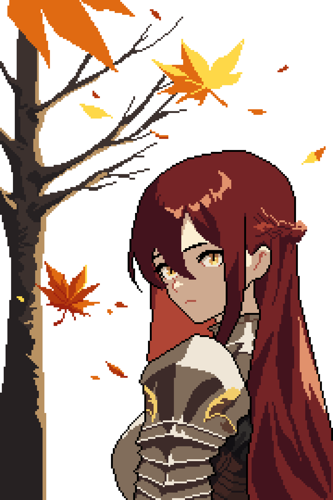

Ich habe mal den großen Schritt getätigt und mir Aseprite geholt, um endlich mal ins Pixel Art Game einzusteigen. Da ich
diese Künste sowieso für zukünftige Projekte benötigen würde, dachte ich, dass ich besser jetzt anfange als nie.
Tatsächlich ist es ziemlich entspannend so vor sich hin zu pixeln.

Meine ersten beiden Versuche:

<table>
<tr>
<td>Yamada-chan</td>
<td>Nokotan</td>
</tr>
</table>

Mit etwas Rumprobiererei bin ich dann zu diesem Bild gekommen:

Das Motiv ist Meilira, einer meiner NPC OCs für meine D&D-Kampagne. Ich bin ganz zufrieden mit dem Ergebnis, auch wenn
Schattierung noch mein Endgegner ist. Auch mit dem Scaling des ganzen Bildes bin ich mir noch nicht so ganz sicher, was
zu groß und was zu klein für bestimmte Motive ist. Zumindest aber vom Gesamtkunstwerk ausgehend, möchte ich noch mehr
Motive meiner OCs zur Übung pixeln.